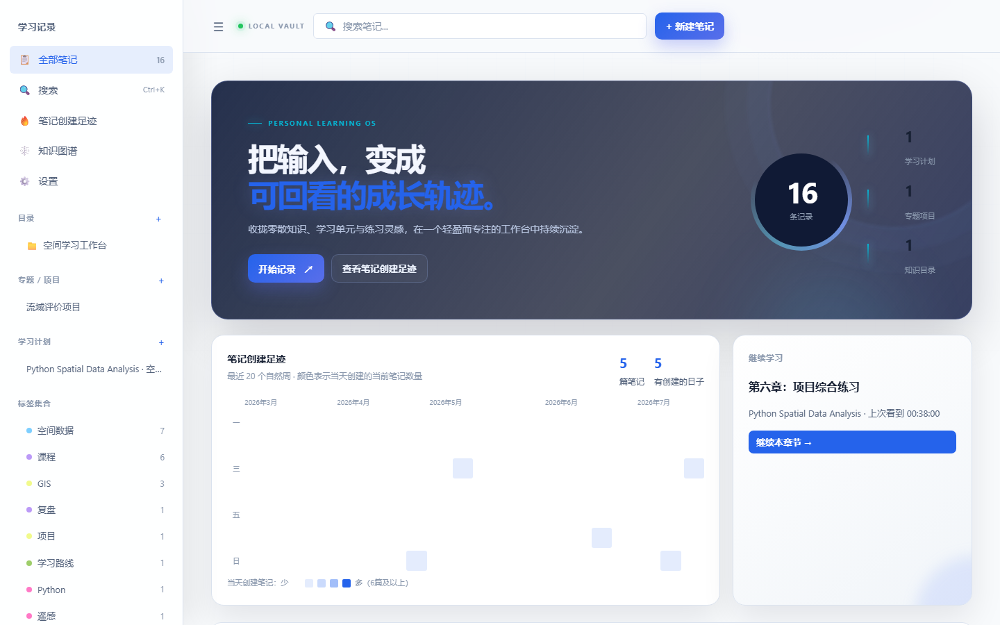
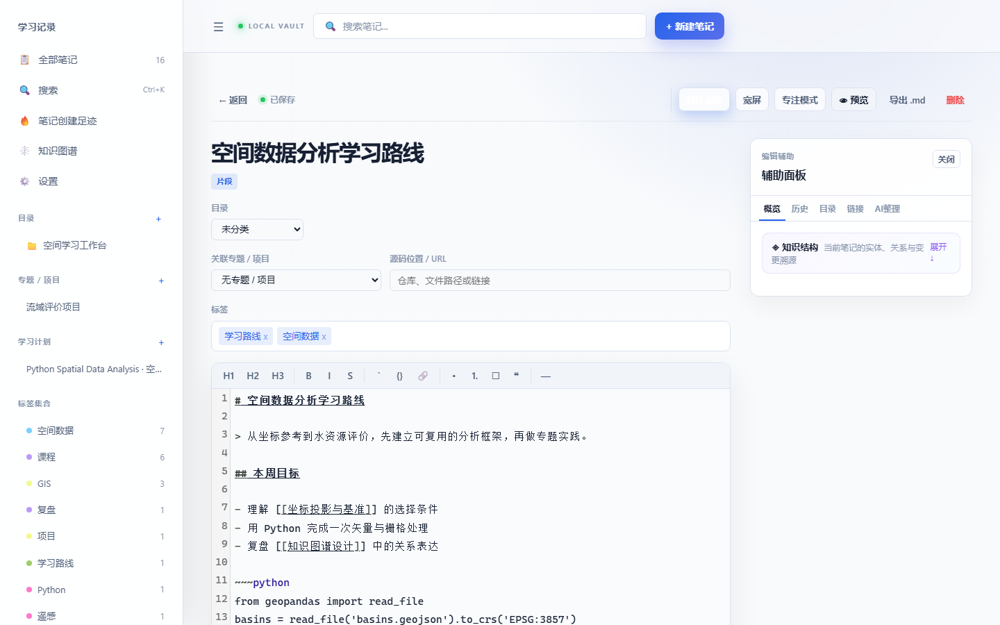
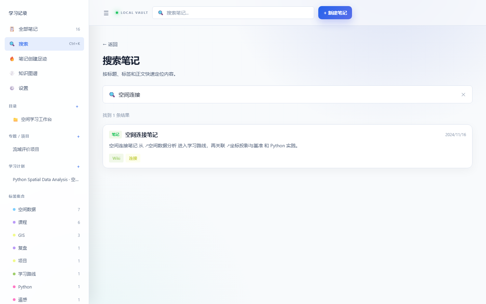
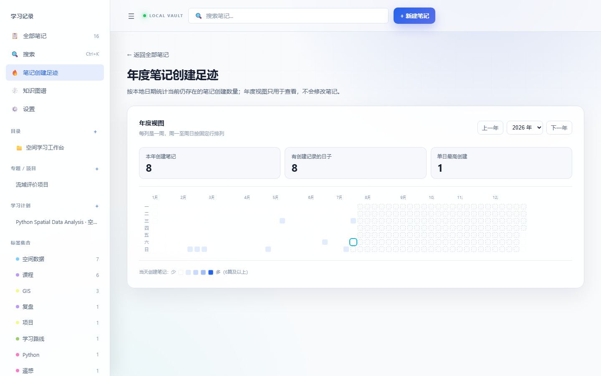
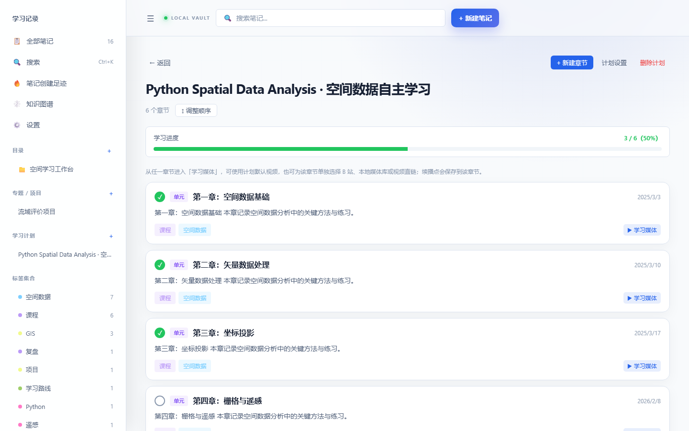
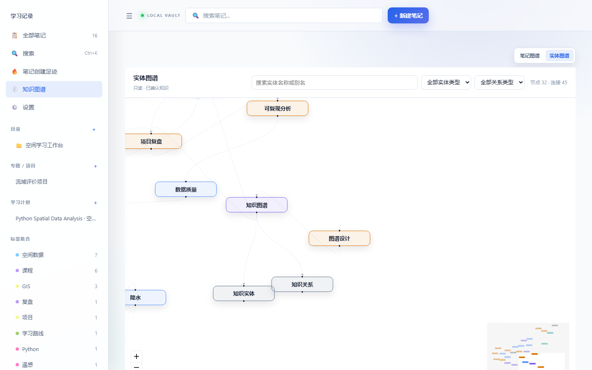
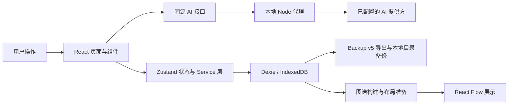

# Learning Knowledge Base（外部知识库）

一个本地优先的个人学习与知识管理应用：将 Markdown 笔记、课程章节、全文搜索、Wiki 链接、知识图谱和 AI 辅助放进同一条学习工作流。

它不试图替代所有通用协作工具，而是面向个人长期学习：记录原始材料、建立可追溯关联、回看学习过程，并把数据默认留在自己的浏览器中。

## 产品截图

以下页面来自隔离的本地演示数据：不使用真实笔记、个人目录、浏览器默认 Profile、API Key 或外部 AI 请求。完整的可重复生成步骤见 [发布演示与截图说明](docs/RELEASE_DEMO.md)。



| 编辑工作区 | 搜索与 Wiki 链接 |
| --- | --- |
|  |  |

| 年度创建足迹 | 课程学习进度 |
| --- | --- |
|  |  |



## 它解决什么问题

学习资料往往散落在临时笔记、课程章节、网页链接和待复习清单里：内容能记下，却难以搜索、关联和回顾；AI 建议也容易脱离原始材料。

Learning Knowledge Base 以本地笔记为中心，提供：

- 完整 Markdown 正文与长期学习单元的连续记录；
- 标题与正文搜索、Wiki 前链和反向链接；
- 课程章节、学习进度、年度创建足迹和随机回顾；
- 笔记图谱与只读、已确认知识实体图谱；
- 需要用户确认才会写入笔记或知识模型的 AI 辅助；
- IndexedDB 本地保存，以及 JSON 和本地目录备份。

## 核心功能

### 笔记与编辑

- Markdown 编辑、预览、代码块、图片、标签、目录与专题/项目组织；
- 支持知识片段和课程章节两类笔记，以及长正文编辑、保存与恢复；
- 编辑器辅助面板集中展示概览、历史、目录、链接和 AI 整理入口；
- Markdown、PDF、Word 导出，回收站可先暂存删除内容。

### 搜索、链接与回顾

- 按标题和正文搜索；正文命中后按需读取完整 Markdown；
- 使用 [[笔记标题]] 建立 Wiki 链接，并展示前向链接与反向链接；
- 识别并浏览孤立笔记；
- 年度笔记创建足迹支持年份切换、Tooltip、键盘操作和按日期打开笔记；
- 首页提供随机回顾与学习组织入口。

### 课程与学习媒体

- 课程、书籍、题库或训练计划可按章节顺序组织；
- 章节可记录完成状态、续播位置和视频片段注释；
- 支持 HTTPS 视频、本地 /media/ 媒体库与临时本地文件；
- 可选浏览器扩展将真实 B 站页面的播放时间与当前笔记连接，不读取或保存 B 站 Cookie。

### 知识结构与图谱

- /graph 提供笔记双链图谱和实体图谱两种模式；
- 实体图谱仅展示 approved 实体和关系，支持名称、实体类型、关系类型筛选、MiniMap 与实体详情导航；
- 实体详情可查看关联笔记、关系、证据笔记和知识变更历史；
- 知识概览与审计记录保持只读浏览边界，不在图谱中直接编辑知识数据。

### AI 辅助

- 对当前笔记生成整理结果预览，用户确认后才替换正文；
- 分析当前笔记的知识实体与关系候选，用户可选择、应用或放弃候选；
- AI 生成历史展示状态、模型、摘要和已产生的知识影响；
- 新建知识数据会保留来源和审计记录；复用人工维护数据时不会覆盖人工字段。

AI 只是一项辅助能力：不会自动批量处理历史笔记，也不会自动批准候选或静默修改知识网络。

### 数据与备份

- 笔记、课程、实体、关系、AI 结果和知识审计保存在浏览器 IndexedDB；
- 设置页支持 Backup v5 JSON 导出、验证、合并恢复和冲突警告；
- 支持本地目录的 latest 备份与每日快照；
- 备份导出与导入共用 100 MiB UTF-8 JSON 上限，避免生成本版本无法恢复的备份。

## 架构概览



- UI 不直接承担跨表持久化写入；业务规则由 service 和纯转换模块组织。
- AI 浏览器客户端只请求同源接口，不持有 API Key、上游地址或授权头。
- 图谱由持久化读取、纯图构建、布局准备和视图展示组成；实体图谱为只读。

## 技术栈

- React、TypeScript、Vite
- Zustand
- Dexie / IndexedDB
- CodeMirror 6、Marked、DOMPurify
- React Flow、d3-force
- Vitest、Node 测试、Playwright
- 本地 Node 静态服务器与同源 AI 代理

## 快速开始

### 环境要求

- Node.js 24（项目通过 package.json 和 .nvmrc 固定主版本）；
- 现代 Chromium 浏览器；
- Windows 用户可直接使用仓库中的启动/停止脚本。

### Windows：本地完整模式

安装依赖后，可以双击 启动知识库.cmd。它会构建应用、启动本地 Node 服务并打开 http://127.0.0.1:4173；结束时双击 停止知识库.cmd。

```powershell
npm install
```

### 开发模式

```bash
npm install
npm run dev
```

Vite 开发服务器默认运行在 http://127.0.0.1:5173。它适合 UI 开发；同源 AI 代理由本地 Node 服务提供，因此开发服务器本身不提供 AI 代理接口。

### 构建与预览

```bash
npm run build
npm run preview  # Vite 静态预览
npm run local    # 本地生产服务器；包含同源 AI 代理边界
```

npm run local 读取已构建的 dist/，默认监听 127.0.0.1:4173。AI 未配置时，笔记、搜索、媒体和其他非 AI 功能仍可正常使用；只有 AI 请求会返回配置缺失提示。

### 测试

```bash
npm run typecheck
npm run test
npm run build
npm run test:e2e
```

首次在新电脑运行浏览器测试时，如 Chromium 尚未安装：

```bash
npx playwright install chromium
```

npm run test:e2e 会先构建 dist/，再启动隔离的生产 Node 服务器 127.0.0.1:4174；不会使用 Vite 开发服务器或调用真实 AI 提供方。

## AI 配置与外部请求边界

AI 配置只在本机 Node 服务读取。请在项目根目录创建未提交的 .env.local：

```dotenv
DEEPSEEK_API_KEY=在此填写你自己的密钥
DEEPSEEK_MODEL=deepseek-v4-flash
DEEPSEEK_BASE_URL=https://api.deepseek.com
```

- 浏览器不会读取、保存或发送 API Key；客户端只向同源 /api/ai/chat/completions 发起请求；
- API Key、模型和上游地址由服务端环境决定，不能由浏览器请求覆盖；
- 不要提交、备份、截图或分享 .env.local；旧版 VITE_DEEPSEEK_* 变量不再生效；
- 启用 AI 后，用户主动提交给 AI 的当前笔记内容和提示会发送至所配置的 AI 提供方；未启用或未触发 AI 时，应用不会因 AI 功能自动上传笔记。

## 数据、隐私与恢复

数据默认保存在当前浏览器 Profile 与站点 origin 对应的 IndexedDB 中，而不是仓库文件夹里的明文笔记。

- 不同浏览器、不同浏览器 Profile 或不同电脑默认不共享数据；
- 清除浏览器站点数据可能删除本地笔记，请先导出 Backup；
- 建议在设置中配置本地目录备份，并定期导出 JSON Backup；
- Backup 恢复会校验数据并报告冲突/跳过项；不会把云同步或协作服务伪装成本地恢复；
- 本地媒体可放入 media/，但个人媒体、备份、导出、浏览器 Profile 和 .env.local 均应保持在 Git 之外。

本项目没有用户登录、云同步、服务端数据库或多人协作功能。

## 质量与验收

截至产品体验升级验收完成时：

- 328 项 Vitest 测试通过；
- 26 项 Node 契约测试通过；
- 33 项生产 Playwright E2E 连续两次通过；
- 已完成性能基线与真实 Microsoft Edge 独立 Profile 手工验收；
- 最终阶段状态为 **ACCEPTED**。

完整证据、环境边界和可信度限制见：[产品体验升级生产验收报告](docs/superpowers/audits/2026-07-18-product-experience-upgrade-acceptance.md)。

## 已知限制

- 数据主要保存在单个浏览器 Profile；尚未提供云同步；
- 正文搜索与孤立链接检查在部分场景可能按需执行 O(N) 扫描；
- 300 实体图谱仍是较重页面，当前体验已通过验收但不代表所有设备都有相同表现；
- DOM 稳定不等于严格证明不存在 Heap 泄漏；尚未进行数小时或数天的长期运行验证；
- html2pdf 仍有既有的大 chunk 构建警告；
- 验收覆盖 Chromium 与一套真实 Edge 环境，不构成所有浏览器、设备或企业合规场景的保证。

## Roadmap

- 使用隔离演示数据生成产品截图与演示材料；
- 整理 v0.1.0 候选发布内容；
- 连续真实使用并收集问题；
- 基于真实使用数据优化搜索和图谱体验；
- 评估跨设备同步与更多数据导入方式，但不预先承诺实现。

## 项目状态

产品体验升级验收已完成。当前定位是可本地运行、可演示的 **v0.1.0 候选版本**；下一阶段聚焦真实使用验证，而不是继续扩展未经验证的新功能。发布范围与尚需人工确认的远端操作见 [更新日志](CHANGELOG.md)、[v0.1.0 候选发布说明](docs/releases/v0.1.0.md) 和 [发布检查清单](docs/RELEASE_CHECKLIST.md)。

## 相关文档

- [开发原则](docs/DEVELOPMENT_PRINCIPLES.md)
- [知识实体图谱设计](docs/superpowers/specs/2026-07-13-knowledge-entity-graph-design.md)
- [产品体验升级验收](docs/superpowers/audits/2026-07-18-product-experience-upgrade-acceptance.md)
- [v0.1.0 候选发布说明](docs/releases/v0.1.0.md)
