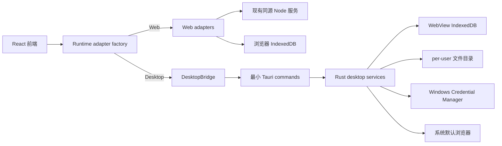
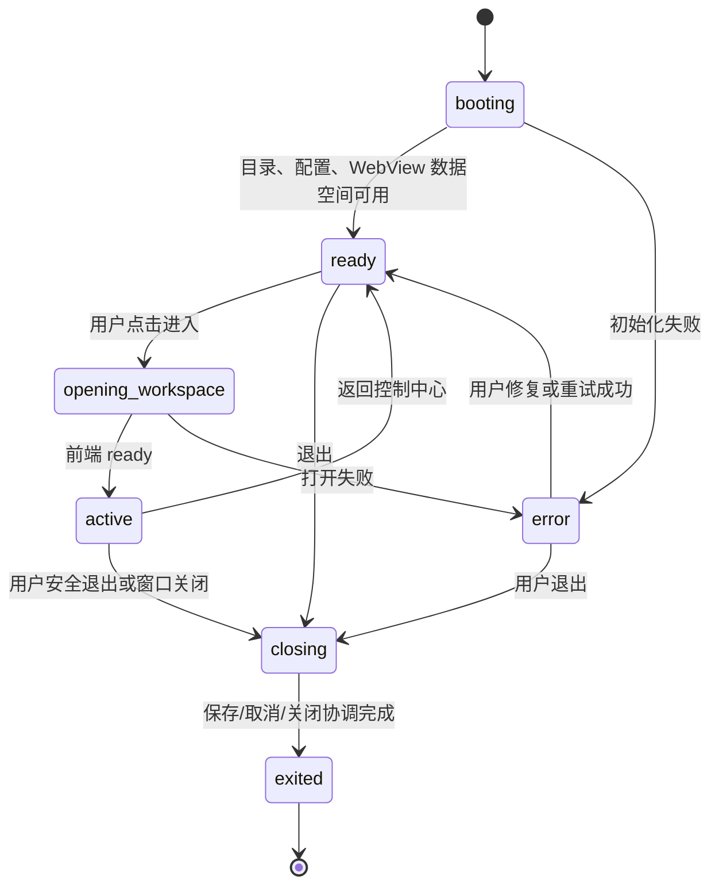

# Learning Knowledge Base v0.2.0 Windows 桌面应用设计

> 状态：架构设计，尚未实现。
> 范围：Windows 桌面交付、控制中心、隐私隔离、学习来源简化和浏览器版手工迁移。
> 不在范围：修改 v0.1.0 Tag/Release、实现业务代码、读取本机私密配置或浏览器数据、Dexie/Backup 升级。
> v0.2.0 已确定基线：Tauri 2 单窗口、无 Node sidecar、无托盘；Dexie v11 与 Backup v5 不变；播放器和 `browser-extension` 删除并改为学习来源；Windows Generic Credential 保存 API Key；WebView2 默认在线 bootstrapper；AI 仅公网 HTTPS；普通卸载保留用户数据与 Backup。

## 1. 结论与当前仓库桌面能力审计

v0.2.0 推荐交付一个 **单窗口 Tauri 2 Windows 应用**。生产桌面版直接加载构建后的前端资源；不启动 Node 服务、不占用 localhost 端口、不打包 Node、npm、源码或 `node_modules`。浏览器版和 `npm run local` 保持为开发、测试与恢复模式，但不作为安装版的后台。

| 审计项 | 当前证据 | 设计结论 |
| --- | --- | --- |
| Web 构建 | `package.json` 的 `build`、`desktop:build`；`src-tauri/tauri.conf.json` 的 `frontendDist: ../dist` | 已具备直接承载静态前端的基础，无 Node sidecar 阻断。 |
| Tauri 后端 | `src-tauri/src/lib.rs` 只创建基础窗口；`src-tauri/capabilities/default.json` 只有 `core:default` | 适合从最小、显式 command/capability 开始；不能把现有浏览器权限直接放大到桌面。 |
| 产品元数据 | `package.json` 为 0.1.0；Tauri `productName` 为“外部知识库”、Tauri/Cargo 版本为 0.0.0；identifier 已为 `com.learningknowledgebase.desktop` | 22-B 统一名称和 v0.2.0 版本；identifier 保持不变。 |
| 浏览器本地服务 | `scripts/local-server.mjs`、`scripts/local-server-control.mjs` 有健康检查、PID、instanceId 和安全归属校验 | 这套逻辑继续服务 Web 模式；桌面退出不能调用它，也不能依据端口或进程名结束进程。 |
| 数据格式 | `src/services/db.ts` 为 Dexie v11；`src/services/backupService.ts` 为 Backup v5 | 桌面 WebView 是新的数据空间；唯一支持的浏览器迁移是用户手工导入 Backup v5。 |
| 媒体/扩展 | `browser-extension/`、`VideoPanel.tsx`、`biliStudyBridge.ts`、编辑器视频路径仍存在 | 22-C 删除播放器和扩展，收敛为“学习来源”；普通附件能力不随之删除。 |

没有发现必须改用 Node sidecar 的阻断问题。反过来，sidecar 会重新引入端口、进程归属、Node 安装、`.env.local` 和安装包秘密边界，违反本版本目标。

## 2. 最终目标架构与 Web/Desktop 双模式



### 2.1 不使用 Node sidecar

- Tauri build 已可把 `dist/` 嵌入或作为桌面资源加载；生产桌面应用没有静态文件服务器需求。
- Rust command 可以执行 AI 网络请求、文件选择、Backup 写入、日志和外部链接，因此不需要 Node 代理持有 Key。
- sidecar 会导致安装包需要带 Node 运行时和脚本，并带来端口冲突、重复双击、残留进程、日志泄露和本地服务误杀风险。
- 浏览器模式仍保留 Node 服务，是因为浏览器不能安全持有 API Key 或获得受限本机文件能力；这是两个运行环境的差异，不是桌面安装版的依赖。

### 2.2 适配器边界

前端只依赖能力接口，不直接访问 `window.__TAURI_*`、Credential Manager 或任意文件路径。

```text
DesktopBridge
├─ AppLifecycleBridge  // 启动、返回控制中心、关闭协调、版本
├─ ConfigBridge        // 非秘密设置
├─ SecretBridge        // 仅“已配置/掩码/保存/删除/测试”结果
├─ AITransport         // 业务 messages，不接收 key、base URL 或 Authorization
├─ BackupBridge        // 选择、创建、恢复前备份、导入/导出
├─ MediaBridge         // 用户选择附件、受限目录文件操作
├─ ExternalLinkBridge  // 仅 http/https，系统默认浏览器
└─ LogBridge           // 脱敏日志摘要与用户清理
```

- `createRuntimeAdapters()` 在启动时只检测受控的桌面 bridge 是否存在；Web 实现继续使用 `WebAITransport`、现有 Web Backup 和 Node 同源代理。
- 接口返回稳定的 `{ code, message, retryable }` 安全错误；前端不展示 Rust 堆栈、HTTP header、响应正文、文件绝对路径或密钥。
- Desktop command 接收最小业务参数。AI command 不接收 `apiKey`、`Authorization`、`baseUrl` 或模型决定权；Rust 将非秘密配置和 SecretStore 读取结果组合后发起请求。
- command capability 必须按窗口和 command 白名单授予；不授予 shell、process、任意 fs、任意 URL 或远程页面主 WebView 导航能力。
- 桌面 CSP 改为“WebView 只访问本地资源”为默认。AI 网络在 Rust 中完成，`connect-src` 不因自定义 AI 地址而放宽；删除 B 站 iframe 后同时移除 `frame-src` 例外。具体 Tauri 协议源和 asset 源在 22-F 用桌面集成测试确认，不能用宽泛 `https:` 代替。

## 3. 桌面控制中心与工作区

单窗口初始展示“桌面控制中心”。它是应用状态入口，不是第二个进程或托盘代理。

| 状态 | 可见内容 | 允许操作 |
| --- | --- | --- |
| 初始化中 | 数据目录、配置与 WebView 数据空间检查 | 仅等待或查看安全错误摘要。 |
| 就绪 | 产品状态、版本、AI 是否已配置、最近备份时间 | 启动并进入知识库、配置 AI、导入浏览器版 Backup、打开备份目录、查看版本、退出。 |
| 正在进入知识库 | 进入进度，阻止重复点击 | 取消仅在尚未开始恢复/写入时可用。 |
| 知识库已打开 | 常规 React 工作区 | 返回控制中心、创建备份、打开备份目录、查看脱敏日志、安全退出。 |
| 正在退出 | 写入/Backup/恢复/AI 请求的协调状态 | 等待、取消可取消任务；不可假称已经安全退出。 |
| 错误 | 安全摘要、恢复建议和可重试动作 | 重试、回到控制中心、选择 Backup、退出。 |

关闭窗口时，应用先请求前端完成编辑器保存栅栏，再询问 Rust 是否有 Backup、恢复、媒体写入或 AI 请求。没有进行中任务则退出；有任务时显示“等待完成 / 取消可取消任务 / 继续退出”的明确选择。v0.2.0 不使用系统托盘、后台隐藏运行或关闭后继续工作。

## 4. 生命周期、单实例与异常恢复

### 4.1 状态机



- 使用 Tauri 单实例能力：第二次启动只激活和聚焦现有窗口，并投递“activate”事件；不创建第二个窗口或后台服务。
- `booting` 创建所需目录但不创建示例笔记、课程、实体或 AI 配置。首次安装因此自然得到空白 WebView IndexedDB。
- 配置损坏：保留损坏文件的受控隔离副本（不包含秘密），显示恢复/重置普通配置选择；不自动清空数据或删除 Credential Manager 条目。
- IndexedDB 打开失败：进入 `error`，不自动删除数据库；提供退出和从用户选择的 Backup 恢复入口。
- WebView2 不可用：安装器检测/引导；运行期显示安全错误和离线安装说明，不尝试下载或执行任意程序。
- 恢复中关闭：默认阻止直接退出；用户若确认取消，结束可取消步骤并保持 Dexie 事务原子性。正在提交的 IndexedDB 事务或原子文件替换不能被伪装为可回滚的跨系统操作。
- AI 请求中退出：Rust 按 request ID 取消可取消 HTTP 请求；到达有限等待时间后以“未完成”状态退出，不保存部分 AI 结果。
- 系统关机、崩溃或强制终止：无法承诺完整收尾。`runtime/` 只记录无秘密的未清洁退出标记；下次启动执行目录/配置检查并提示最近 Backup，不会自动删除数据。
- “安全退出”只终止本 Tauri 进程。它绝不结束 Node、本机端口进程或其他应用。

## 5. per-user 数据目录与隔离

稳定 identifier 为 `com.learningknowledgebase.desktop`。普通桌面数据统一使用 Tauri `appLocalDataDir` 对应的当前 Windows 用户 `LocalAppData`，不使用 Roaming AppData 存放主要数据。identifier 是应用数据、Credential Manager 命名空间、升级识别和 WebView 数据空间的边界；随意改名会让升级看似“丢失数据”并创建另一套空白空间。

```text
%LOCALAPPDATA%\com.learningknowledgebase.desktop\
├─ config\          # 普通 JSON 设置；绝不含 API Key
├─ media\           # 用户明确导入/复制的普通附件
├─ backups\         # 默认 Backup 目录，latest 与每日快照
├─ logs\            # 脱敏、轮转的本地日志
├─ temp\            # 原子写入临时文件和可清理工作文件
├─ runtime\         # 单实例/未清洁退出等无秘密状态
└─ webview\         # 由 Tauri/WebView2 管理的 WebView、IndexedDB 数据
```

- Rust 通过 Tauri `appLocalDataDir` 解析当前用户 `LocalAppData` 根目录；不使用 Roaming AppData 存放主要数据。UI 只展示“备份目录”等逻辑名称，日志和错误界面不显示 Windows 用户名或绝对路径。
- Windows 用户帐户天然隔离 `%LOCALAPPDATA%`、WebView 用户数据和 Credential Manager。不能扫描、复制或合并其他帐户/浏览器 Profile。
- 覆盖升级保留整个数据根目录；普通卸载只删除程序安装目录，默认保留上述数据、媒体、日志和 Backup。
- 重新安装同 identifier 的应用会重新连接当前 Windows 用户原数据。应用内“删除本机全部数据”是独立危险操作：默认删除笔记、课程、实体关系、普通配置、Credential Manager Key、应用媒体、日志、运行状态和临时数据；展示范围、二次确认并要求输入确认文字。`backups/` 默认保留；“同时删除所有备份”必须是单独的非默认选项，并要求第二次确认。普通卸载永不触发它。
- Backup 不应放入临时目录，默认不自动删除用户 Backup。日志单文件最大 2 MiB，最多保留 5 个文件，最长保留 14 天；`temp/` 仅在启动时清理超过 7 天且由本应用创建的文件，运行中的原子写入文件不能被清理。

## 6. 普通配置、SecretStore 与 API Key 生命周期

### 6.1 存储选择

v0.2.0 已确定 Windows 使用 **Win32 Credential Manager 的 Generic Credential**，并在 Rust 中定义 `SecretStore` trait。它与 Windows 用户帐户隔离、无需前端处理明文、无需自行管理加密主密钥，并为未来其他平台保留可替换后端。

| 方案 | 结论 |
| --- | --- |
| Windows Credential Manager（Generic Credential） | v0.2.0 已确定。通过稳定 service/target 名称保存单个 API Key，Rust 读取后只在内存中短暂使用。 |
| Tauri Stronghold | 可作为跨平台后续候选，但需要设计 vault 文件、解锁/恢复语义和密钥材料；不是本版本更简单的 Windows 方案。 |
| 普通 JSON、localStorage、IndexedDB、Backup | 禁止存储 API Key。 |

普通配置仅包括 AI 服务商、HTTPS Base URL、模型、超时时间和启用标志。建议 target 名称形如 `com.learningknowledgebase.desktop/ai/<provider>/api-key`，其中 provider 是受验证的标识符。

### 6.2 Key 生命周期

1. 控制中心打开“配置 AI”；前端只得到 `configured: boolean` 与脱敏尾号，永不获得完整 API Key。
2. 用户输入 Key 时直接送入受限 Rust command；前端不把 Key 写入 Zustand、日志、localStorage、Dexie、普通设置或 Backup。
3. Rust 验证非秘密配置，调用 SecretStore 保存/替换 Key；界面显示成功而非回显 Key。
4. “测试连接”由 Rust 读取 Key 后执行受限请求，返回安全状态、耗时和可显示的错误码。
5. 修改 Key 等同于替换；“忘记凭据”只删除 Credential Manager 项并将 AI 状态变为未配置。
6. Windows 用户切换时每个用户读取自己的凭据；升级不改变 target 名称，因此凭据继续可用。

AI 未配置、Key 无效或测试失败时，笔记、搜索、课程、图谱、来源、Backup 和恢复必须继续工作。

### 6.3 AI 网络、日志与外部链接边界

- v0.2.0 仅允许公网 HTTPS AI 接口；拒绝 `file:`、`javascript:`、命令协议、嵌入凭据 URL、`localhost`、局域网 HTTP、私网 IP 和本机模型服务。未来若需要本地模型，必须通过独立安全设计启用，而不是放宽本版本规则。
- 固定聊天路径/请求形状，禁止前端任意 URL 代理；设置不少于 60 秒的上游超时、请求与响应大小上限，并在关闭时取消可取消请求。
- 不转发 Cookie、Authorization 或敏感上游 header 给前端；错误只含安全 code、简短说明与必要状态。
- 日志永不包含 Key、Authorization、Cookie、完整 prompt、完整笔记、Backup、媒体、用户名或绝对路径。日志默认仅本地保存、分级、脱敏、单文件大小限制和轮转；用户可以清理。v0.2.0 不启用遥测或远程错误上报。
- 外部来源只在用户点击后通过系统默认浏览器打开。Rust 先解析 URL，仅允许 `http:`/`https:`；拒绝 `file:`、`javascript:`、`shell:`、`cmd:`、`powershell:` 及任何命令协议。主 WebView 不导航到远程页面，也不读取 Cookie、浏览器历史或下载视频。

## 7. 学习媒体简化为学习来源

### 7.1 产品模型

移除“播放/续播工具”，保留可追溯的学习来源。v0.2.0 已确定一个笔记或课程章节允许记录多个来源，建模为未索引、可选的 `LearningSource[]` 嵌入现有 Note/Course 记录；每项包含：`id`、来源标题、来源 URL、平台、作者或课程名称、普通备注、`createdAt`、`updatedAt`。每条来源可独立添加、编辑、删除，并仅在用户主动点击时使用系统浏览器打开其 `http:`/`https:` URL。这不需要新表或索引，因此第一阶段保持 Dexie v11；Backup v5 继续以整条 Note/Course 记录携带可选字段。

为避免对旧 Backup v5 进行猜测性重写，读取顺序为：新 `learningSources` 优先；不存在时从旧字段生成只读“遗留来源”展示。用户首次编辑并确认时才写入新来源条目，同时保留旧字段。实现前必须让 `dataValidation.ts` 的严格 normalizer 显式接受、限制并保留该可选字段，否则 Backup v5 恢复会静默丢失新字段。

来源操作只有添加、编辑、删除、打开原始来源。它不读取播放状态、Cookie、登录状态或浏览器页面，不自动下载媒体。

### 7.2 旧媒体数据无损兼容表

| 现有字段/内容 | v0.2.0 行为 | 破坏性操作 |
| --- | --- | --- |
| `Note.mediaUrl` | 作为遗留来源 URL 回退展示；编辑时可复制为新来源 URL | 不清空。 |
| `Course.videoUrl` | 作为课程遗留来源 URL 回退展示 | 不清空。 |
| `Note.sourceLocation` | 保留原文本；可作为来源标题或备注的用户可编辑起点，不能自动猜测语义 | 不重写。 |
| `Course.source` | 保留课程来源文本；可作为平台/作者/备注的用户可编辑起点 | 不重写。 |
| `Note.videoTimestamp` | 不再参与续播或播放器；正文中的时间点/片段文字原样保留 | 不删除。 |
| Markdown 中的时间点、链接和片段 | 继续是普通正文 | 不解析、不迁移、不删除。 |
| 旧 Backup v5 | 保持可恢复标题、URL 与备注相关的旧字段 | 不提升 Backup 版本。 |

### 7.3 删除范围清单（22-C 的输入）

- 删除整个 `browser-extension/`：manifest、content scripts、service worker、side panel、README 与扩展测试/文档入口。
- 删除 `src/components/VideoPanel.tsx`、`src/services/biliStudyBridge.ts`，以及播放器、画中画、B 站桥接、时间点自动写入和浏览器 `postMessage` 路径。
- `src/services/mediaSource.ts` 不能原样保留 `/media/`/播放器语义；可删除，或在明确的新文件中仅复用严格的 http/https 来源 URL 校验，不能沿用“本地服务媒体 URL”权限假设。
- 调整 `EditorPage.tsx`、`CourseDetailPage.tsx`、`Sidebar.tsx`、`HomePage.tsx`、`projectStore.ts`、`projectService.ts`、`noteProjection.ts`、`noteService.ts`、`exportService.ts`、`dataValidation.ts`、`types/index.ts` 和 `db.ts` 中的展示/默认值/兼容逻辑；保留旧字段的读取兼容，不做 Dexie v12。
- 更新或删除涉及视频、B 站、画中画、续播、扩展通信、`?video=1` 的 Vitest、Node、Playwright 用例；更新 README、媒体说明、课程文案和扩展安装教程引用。

普通附件与本地媒体能力仍存在，只是不能再作为内嵌播放器、自动续播或 B 站扩展功能。

## 8. 浏览器版迁移、文件/媒体/Backup 权限

### 8.1 唯一支持的迁移

桌面 WebView 的 IndexedDB 与浏览器 Profile/origin 隔离。禁止自动扫描 Chrome、Edge、Firefox Profile，禁止复制 IndexedDB，也禁止读取开发者 Backup。

```text
浏览器 v0.1.0 导出 Backup v5
  -> 用户在桌面控制中心选择文件
  -> Rust/前端验证格式、版本、大小和完整性
  -> 展示表计数与冲突摘要
  -> 桌面版先创建恢复前安全 Backup
  -> 用户明确选择合并或恢复
  -> 单一 Dexie 事务写入 v11
  -> 记录本地审计与安全摘要
```

恢复不能静默覆盖、不能绕过解析校验、不能通过手改 JSON 规避冲突规则。恢复前安全 Backup 的写入失败必须阻止恢复开始。

### 8.2 文件系统权限

- 前端只能请求“选择文件/目录”“保存到已选目录”等受限 bridge 动作，不能获得任意文件系统路径或原始权限。
- Rust 对每个用户选择目录创建受控 handle/令牌，canonicalize 后验证根目录包含关系，拒绝路径遍历、绝对路径逃逸和符号链接/联接点越界。
- 默认 Backup 写入 `backups/`；用户自选目录需要再次确认并保存为普通配置。latest 与每日快照继续使用同一已验证序列化文本，临时文件写完、flush 后原子替换。
- 处理磁盘不足、无权限、写入中断和文件名冲突时返回明确安全错误；不截断旧 Backup、不删除已有有效快照。
- 媒体/附件导入采用文件选择器和受限复制，不接受前端提供的任意源路径。附件超过 25 MiB 时提示；单附件硬上限为 100 MiB；写入前检查磁盘剩余空间。允许扩展名和复制/引用策略由 22-F 明确并测试。

## 9. 安装、升级与卸载生命周期

### 9.1 NSIS 安装设计

- 产品名改为“学习知识库”；`package.json`、`src-tauri/tauri.conf.json` 和 `Cargo.toml` 在发布时使用同一 v0.2.0 版本。
- 采用当前用户安装，建议程序目录 `%LOCALAPPDATA%\Programs\学习知识库`，不强制管理员权限；用户数据仍在 identifier 对应目录，绝不放在安装目录。
- NSIS 产物包含 Tauri 可执行文件、编译前端、Rust 后端、图标、公开默认配置、必要运行时资源、卸载器、桌面快捷方式和开始菜单入口；不包含 Node、npm、源码、`node_modules` 或脚本。
- WebView2：v0.2.0 主安装包已确定采用在线 bootstrapper 检测和安装 Evergreen Runtime，并提供明确失败提示；离线 WebView2 安装包不作为默认交付。22-H 根据内测电脑环境决定是否额外生成离线安装版，并验证 Tauri 2 的精确配置与许可证。
- 覆盖升级保留 per-user 数据、Credential Manager Key、媒体和 Backup。安装失败回滚只撤销本次安装目录变更，不能触碰原用户数据。
- 普通卸载删除程序和快捷方式，默认保留用户数据与 Backup；“删除本机全部数据”只能在应用内显式执行。
- 朋友内测阶段允许未签名安装包，但必须提供 SHA-256 和 SmartScreen 风险说明；正式公开发布前再决定并引入代码签名证书与发行流程。v0.2.0 不实现自动更新。

### 9.2 安装包白名单与明确排除

白名单按类别检查安装器实际解包清单：Tauri EXE/卸载器、前端生产资源、图标、Tauri/Rust 运行时依赖、NSIS 语言/运行时文件、经过批准的 WebView2 引导资源、公开默认配置。每次构建将实际文件清单与此白名单比对。

明确排除：`.env`、`.env.local`、Key/token/cookie/header、真实笔记/课程/实体/关系/AI 历史、Backup JSON、私有媒体、浏览器 Profile、IndexedDB、`.runtime`、日志、临时文件、`test-results`、`playwright-report`、Playwright Profile、`G:\Learning system`、Windows 用户名、开发者绝对路径、Node/npm、源码、`node_modules`、browser-extension。

## 10. 干净构建与隐私门禁

正式安装包只能从干净克隆和隔离 Windows 用户/构建目录生成：

1. `git clone` 并校验目标提交 SHA；
2. `npm ci`；
3. `npm audit --omit=dev` 和 `npm audit`，记录结果但绝不执行 `npm audit fix --force`；
4. `npm run typecheck`、`npm run test`、版本契约测试、`npm run test:e2e`；
5. `cargo fmt --check`、`cargo clippy`、`cargo test`；
6. Tauri NSIS build；
7. 生成安装器 SHA-256（Windows 可用 `Get-FileHash -Algorithm SHA256`）；
8. 解包 NSIS 到隔离临时目录，按白名单检查文件；
9. 扫描 frontend bundle、EXE、资源和安装脚本，输出只含文件名/规则名的隐私报告；
10. 在干净 Windows 用户安装验收，再删除测试用户数据。

扫描规则包括 `.env`、`sk-` 长令牌、`Bearer`、`Authorization`、`API_KEY`、`TOKEN`、`Cookie`、真实笔记 canary、浏览器 Profile、`AppData`、开发路径、`.runtime`、测试报告和个人用户名。`Backup` 等业务词会存在于正常代码，因此只作为人工分类线索，不能单独作为阻断条件；真实 canary、秘密形态和绝对开发者路径是阻断条件。

## 11. 测试矩阵

| 层级 | 最小覆盖 |
| --- | --- |
| Rust 单元 | 目录范围、普通配置、SecretStore、AI 请求限制、日志脱敏、外部链接、Backup 原子写入、媒体导入、生命周期状态机。 |
| 前端 | 控制中心状态、首次启动、AI 未配置、Key 掩码、来源 CRUD、非法 URL、Backup 导入摘要、错误状态、安全退出握手。 |
| 桌面集成 | 无 Node/npm/Rust/源码运行、无终端窗口、重复双击、单实例聚焦、关闭/崩溃恢复、恢复中退出、AI 取消、无权限目录、磁盘不足。 |
| 安装验收 | 全新 Windows 用户和第二用户均为空数据/未配 AI；两用户隔离；覆盖升级保留数据；普通卸载保留 Backup；重新安装恢复数据；主动删除全部数据后才清除；快捷方式可用。 |
| 隐私门禁 | source ZIP 和 NSIS 解包扫描、bundle/EXE 关键字/路径/canary 扫描、安装包 SHA-256、无开发者数据确认。 |

## 12. 后续实施任务拆分

### 22-B：桌面工程与数据目录基线

- **目标**：统一产品名、v0.2.0 版本、identifier 使用、per-user 目录和单实例基础。
- **文件范围**：`src-tauri/`、版本元数据、最小桌面 bridge 类型与 Rust 测试。
- **边界**：不接入 AI、Backup、播放器删除或安装发布。
- **测试/验收**：第二次启动聚焦已有窗口；空用户目录启动；没有 Node 服务；identifier 不变。
- **风险**：Tauri 单实例插件与窗口事件的 Windows 行为；必须桌面集成验证。
- **提交**：`feat: establish desktop application baseline`。

### 22-C：学习来源替代播放器和扩展

- **目标**：删除播放器/B 站扩展，提供来源 CRUD 和安全外部打开。
- **文件范围**：`browser-extension/`、Video/Bili 代码、编辑器/课程 UI、类型、validation、Backup 兼容测试和相关文档。
- **边界**：Dexie 保持 v11、Backup 保持 v5；旧字段只读兼容且不破坏清理。
- **测试/验收**：旧 Backup 可读 URL/标题/备注；非法协议拒绝；没有播放器或扩展引用；普通附件仍可用。
- **风险**：严格 Backup normalizer 可能丢弃新的可选来源字段，必须先补测试。
- **提交**：`feat: replace learning media with sources`。

### 22-D：控制中心与安全退出

- **目标**：实现控制中心、生命周期状态机、进入/返回工作区与关闭协调。
- **文件范围**：控制中心页面/状态、App 路由壳、生命周期 bridge/Rust command、前端与 Rust 测试。
- **边界**：不实现托盘、后台运行、AI secrets 或安装器。
- **测试/验收**：首次启动、重复点击、写入/恢复/AI 中关闭提示、返回控制中心、崩溃标记修复。
- **风险**：前端保存栅栏与窗口关闭竞态；不能把强制终止描述为安全退出。
- **提交**：`feat: add desktop control center lifecycle`。

### 22-E：配置和 Credential Manager

- **目标**：实现普通配置、SecretStore、首次 AI 配置和忘记凭据。
- **文件范围**：Rust SecretStore/config、受限 command、配置 UI、脱敏测试。
- **边界**：不改变 AI prompt、AIResult、Backup 或前端持久化模型。
- **测试/验收**：Key 不出现在 bundle/IndexedDB/JSON/log；用户切换隔离；未配置 AI 仍可用；测试连接安全失败。
- **风险**：Windows API/crate 选择和凭据 target 稳定性；Stronghold 不作为本任务替代实现。
- **提交**：`feat: add desktop credential-backed AI settings`。

### 22-F：Rust bridge、AI、链接、日志和文件

- **目标**：实现 Tauri AITransport、外部链接、日志、媒体/附件和文件目录 bridge。
- **文件范围**：Rust commands、capabilities、前端 adapters、URL/file 范围测试。
- **边界**：不授予 shell/任意 fs/任意网络代理；不重新设计知识模型。
- **测试/验收**：HTTPS/大小/超时限制、http/https 外链、非法协议拒绝、目录越界与符号链接拒绝、日志脱敏。
- **风险**：CSP/capability 误放宽；需要桌面实际 WebView 验收。
- **提交**：`feat: add secure desktop bridges`。

### 22-G：Backup v5 桌面迁移和用户数据生命周期

- **目标**：实现手工 Browser Backup v5 导入、恢复前安全 Backup、数据删除功能和升级保留策略。
- **文件范围**：desktop Backup bridge、恢复 UI、目录/原子写入服务、迁移/生命周期测试。
- **边界**：不扫描浏览器 Profile，不升级 Dexie/Backup，不自动覆盖。
- **测试/验收**：合并/恢复摘要、恢复前备份失败阻止、普通卸载保留、显式删除全数据才清除。
- **风险**：跨文件不具完全原子性；如实报告已成功文件，不能删除旧备份掩盖失败。
- **提交**：`feat: add desktop backup migration lifecycle`。

### 22-H：NSIS 交付与 WebView2

- **目标**：配置当前用户 NSIS、产品名、图标、开始菜单/桌面快捷方式和 WebView2 策略。
- **文件范围**：Tauri bundle 配置、安装验收脚本与文档。
- **边界**：不实现自动更新、托盘或 Node sidecar。
- **测试/验收**：无 Node/npm/Rust/源码安装运行；快捷方式可用；安装失败回滚；普通卸载保留数据。
- **风险**：默认在线 bootstrapper 在离线内测电脑上不可用；若内测证据要求，再额外生成离线安装版。未签名内测包仍可能触发 SmartScreen。
- **提交**：`feat: package Windows desktop installer`。

### 22-I：干净构建与安装包隐私门禁

- **目标**：自动化干净克隆、构建、解包、扫描、SHA-256 与双用户安装验收。
- **文件范围**：发布脚本、扫描规则、CI/发布文档和测试 fixtures。
- **边界**：不读取开发者实际数据，不在脚本中保存 Key 或个人路径。
- **测试/验收**：扫描报告、白名单差异阻断、canary 阻断、安装包文件清单、隔离用户验收。
- **风险**：宽泛关键字误报；规则需区分正常业务字样和真实秘密/路径/canary。
- **提交**：`test: add desktop release privacy gates`。

### 22-J：v0.2.0 候选发布

- **目标**：从干净构建产物形成候选安装包、SHA-256、发布说明、Tag 和 GitHub Release。
- **文件范围**：版本/发布文档与正式产物；不回改功能实现。
- **边界**：不移动 v0.1.0 Tag/Release；不在未通过门禁时发布。
- **测试/验收**：22-I 全部通过、安装验收记录、发布前人工确认、签名/SmartScreen 状态说明。
- **风险**：未签名公开分发的信誉警告；不能以“候选”掩盖隐私扫描失败。
- **提交**：`chore: prepare v0.2.0 release candidate`。

## 13. 风险清单、人工决定与推荐顺序

### 13.1 主要风险

| 级别 | 风险 | 缓解 |
| --- | --- | --- |
| P0 | 安装包意外携带开发者数据、Key 或绝对路径 | 仅干净克隆构建、canary 和解包扫描、白名单阻断。 |
| P0 | Secret 进入前端/普通配置/日志 | Credential Manager + Rust-only SecretStore + bundle/log 测试。 |
| P1 | 窗口关闭时出现保存/恢复/AI 半完成状态 | 显式状态机、事务/原子写入边界、可见关闭提示和崩溃恢复。 |
| P1 | 播放器删除造成旧 Backup/正文损失 | 旧字段只读兼容、无损保留、先测试 normalizer。 |
| P1 | 能力过宽导致任意文件/URL/Shell 访问 | command 白名单、路径 canonicalize、协议 allow-list、无 shell capability。 |
| P2 | WebView2 安装和未签名 SmartScreen 降低内测可用性 | 明确安装策略、SHA-256、内测说明、正式签名计划。 |

### 13.2 仍需人工决定的问题

1. 朋友内测的 SHA-256 发布渠道、已知 SmartScreen 提示文案，以及正式公开发布时引入何种代码签名证书。
2. 22-H 内测完成后，是否额外生成非默认的离线 WebView2 安装版。
3. 允许的附件扩展名清单、复制或引用策略，以及“写入前可用磁盘空间”所需的最低余量阈值。

### 13.3 推荐执行顺序

`22-B → 22-C → 22-D → 22-E → 22-F → 22-G → 22-H → 22-I → 22-J`。

先固定桌面身份、空数据空间和单实例，再移除高风险播放器/扩展；随后建立控制中心和秘密边界。Backup/文件桥接必须在安装器之前完成，最后才进入干净构建、隐私门禁和正式候选发布。

## 14. 明确非目标

v0.2.0 不包含 Node sidecar、固定 localhost 端口、系统托盘、隐藏后台运行、自动更新、自动浏览器数据迁移、自动媒体下载、B 站播放器/扩展、任意 Shell/PowerShell/CMD、任意文件系统访问、任意 URL 代理、默认遥测或远程错误上报。
